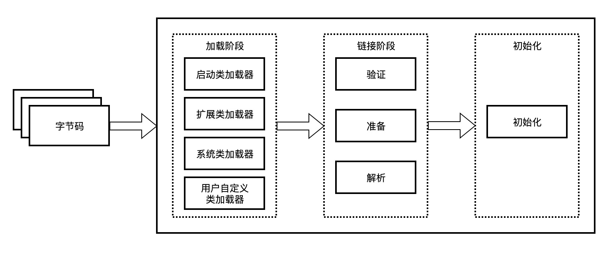
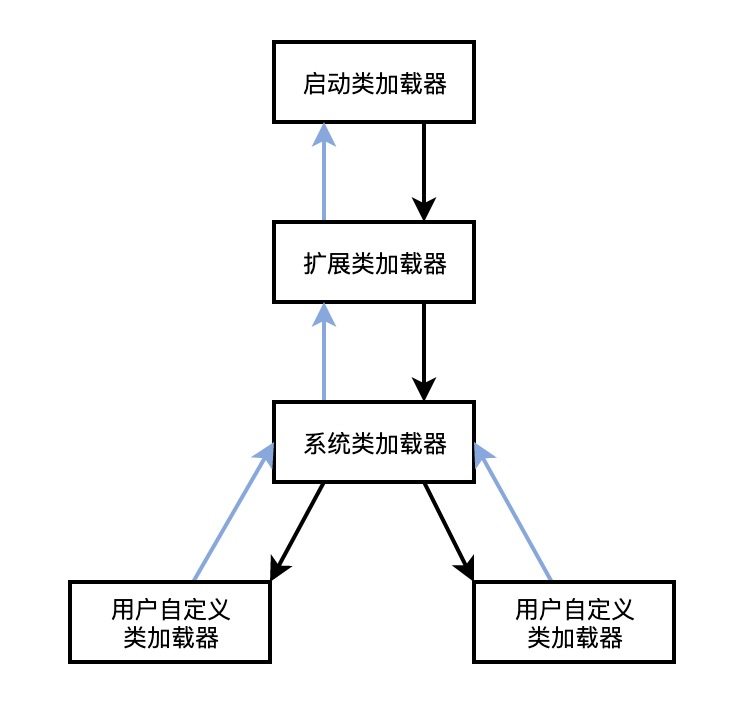

## 1类加载过程

类的生命周期包括：加载、链接、初始化、使用和卸载，其中`加载`、`链接`、`初始化`，属于`类加载的过程`，我们下面仔细讲解




### 1.1加载

> 通过类的全限定名（包名 + 类名），获取到该类的 .class文件的二进制字节流
>
> 将二进制字节流所代表的静态存储结构，转化为**方法区**运行时的数据结构
>
> 在`内存`中生成一个代表该类的`java.lang.Class`对象，作为方法区这个类的各种数据的访问入口


总结：`加载二进制数据到内存` —> `映射成jvm能识别的结构` —> `在内存中生成class文件`。


### 1.2连接

链接是指将上面创建好的class类合并至Java虚拟机中，使之能够执行的过程，可分为`验证`、`准备`、`解析`三个阶段。

**① 验证（Verify）**

> 确保class文件中的字节流包含的信息，符合当前虚拟机的要求，保证这个被加载的class类的正确性，不会危害到虚拟机的安全。

验证阶段大致会完成4个阶段的检验动作：

- **文件格式验证**：验证字节流是否符合Class文件格式的规范；例如：是否以`0xCAFEBABE`开头、主次版本号是否在当前虚拟机的处理范围之内、常量池中的常量是否有不被支持的类型。
- **元数据验证**：对字节码描述的信息进行语义分析（注意：对比javac编译阶段的语义分析），以保证其描述的信息符合Java语言规范的要求；例如：这个类是否有父类，除了`java.lang.Object`之外。
- **字节码验证**：通过数据流和控制流分析，确定程序语义是合法的、符合逻辑的。
- **符号引用验证**：确保解析动作能正确执行。

**② 准备（Prepare）**

> 为类中的`静态字段`分配内存，并设置默认的初始值，比如int类型初始值是0。被final修饰的static字段不会设置，因为final在编译的时候就分配了

**③ 解析（Resolve）**

> 解析阶段的目的，是将常量池内的符号引用转换为直接引用的过程（将常量池内的符号引用解析成为实际引用）。如果符号引用指向一个未被加载的类，或者未被加载类的字段或方法，那么解析将触发这个类的加载（但未必触发这个类的链接以及初始化。）
>
> 事实上，解析器操作往往会伴随着 JVM 在执行完初始化之后再执行。 符号引用就是一组符号来描述所引用的目标。符号引用的字面量形式明确定义在《Java 虚拟机规范》的Class文件格式中。直接引用就是直接指向目标的指针、相对偏移量或一个间接定位到目标的句柄。
>
> 解析动作主要针对类、接口、字段、类方法、接口方法、方法类型等。对应常量池中的 CONSTANT_Class_info、CONSTANT_Fieldref_info、CONSTANT_Methodref_info等。

### 1.3初始化

为类的静态变量赋予正确的初始值，JVM负责对类进行初始化，主要对类变量进行初始化。在Java中对类变量进行初始值设定有两种方式：

- ①声明类变量是指定初始值
- ②使用静态代码块为类变量指定初始值

JVM初始化步骤

- 1、假如这个类还没有被加载和连接，则程序先加载并连接该类
- 2、假如该类的直接父类还没有被初始化，则先初始化其直接父类
- 3、假如类中有初始化语句，则系统依次执行这些初始化语句

类初始化时机：只有当对类的主动使用的时候才会导致类的初始化，类的主动使用包括以下六种：

- 创建类的实例，也就是new的方式
- 访问某个类或接口的静态变量，或者对该静态变量赋值
- 调用类的静态方法
- 反射（如`Class.forName(“com.shengsiyuan.Test”)`）
- 初始化某个类的子类，则其父类也会被初始化
- Java虚拟机启动时被标明为启动类的类（`Java Test`），直接使用`java.exe`命令来运行某个主类


## 2 类加载器分类

### 2.1 几种类加载器

- **启动类加载器**：`Bootstrap ClassLoader`，负责加载存放在`JDK\jre\lib`(JDK代表JDK的安装目录，下同)下，或被`-Xbootclasspath`参数指定的路径中的，并且能被虚拟机识别的类库（如rt.jar，所有的java.开头的类均被`Bootstrap ClassLoader`加载）。这个类加载器使用C/C++语言实现的，嵌套在JVM内部，java程序无法直接操作这个类。

  出于安全考虑，启动类只加载包名为：java、javax、sun开头的类

- **扩展类加载器**：`Extension ClassLoader`，该加载器由`sun.misc.Launcher$ExtClassLoader`实现，它负责加载`JDK\jre\lib\ext`目录中，或者由`java.ext.dirs`系统变量指定的路径中的所有类库（如javax.开头的类），开发者可以直接使用扩展类加载器。 在jdk1.9及以后的版本，称之为 `PlatformClassLoader` 。

- **应用程序类加载器**：`Application ClassLoader`，该类加载器由`sun.misc.Launcher$AppClassLoader`来实现，它负责加载用户类路径（ClassPath）所指定的类，开发者可以直接使用该类加载器，如果应用程序中没有自定义过自己的类加载器，一般情况下这个就是程序中默认的类加载器。

- **用户自定义类加载器：** `User Classloader`，一般情况下，以上3种加载器能满足我们日常的开发工作，不满足时，我们还可以`自定义加载器`

  比如用网络加载Java类，为了保证传输中的安全性，采用了加密操作，那么以上3种加载器就无法加载这个类，这时候就需要`自定义加载器`


### 2.2 自定义类加载器的实现步骤

继承`java.lang.ClassLoader`类，重写findClass()方法，如果没有太复杂的需求，可以直接继承`URLClassLoader`类，重写`loadClass`方法，具体可参考`AppClassLoader`和`ExtClassLoader`。


**示例**

```java
package com.fun.classloader;
import java.io.*;

public class MyClassLoader extends ClassLoader {
    private String root;

   // 重新的findClass 而不是 loadClass , 做到自定义获取字节码，同时不破坏双亲委派机制，后面会说到
    protected Class<?> findClass(String name) throws ClassNotFoundException {
        byte[] classData = loadClassData(name);
        if (classData == null) {
            throw new ClassNotFoundException();
        } else {
            return defineClass(name, classData, 0, classData.length);
        }
    }

    private byte[] loadClassData(String className) {
        String fileName = root + File.separatorChar
                + className.replace('.', File.separatorChar) + ".class";
        try {
            InputStream ins = new FileInputStream(fileName);
            ByteArrayOutputStream baos = new ByteArrayOutputStream();
            int bufferSize = 1024;
            byte[] buffer = new byte[bufferSize];
            int length = 0;
            while ((length = ins.read(buffer)) != -1) {
                baos.write(buffer, 0, length);
            }
            return baos.toByteArray();
        } catch (IOException e) {
            e.printStackTrace();
        }
        return null;
    }

    public String getRoot() {
        return root;
    }

    public void setRoot(String root) {
        this.root = root;
    }

    public static void main(String[] args)  {

        MyClassLoader classLoader = new MyClassLoader();
        classLoader.setRoot("E:\\temp");

        Class<?> testClass = null;
        try {
            testClass = classLoader.loadClass("com.fun.classloader.Test");
            Object object = testClass.newInstance();
            System.out.println(object.getClass().getClassLoader());
        } catch (Exception e) {
            e.printStackTrace();
        } 
    }
}


```


### 2.3 获取ClassLoader几种方式

它是一个抽象类，其后所有的类加载器继承自 ClassLoader（不包括启动类加载器）

```
// 方式一：获取当前类的 ClassLoader
clazz.getClassLoader()
// 方式二：获取当前线程上下文的 ClassLoader
Thread.currentThread().getContextClassLoader()
// 方式三：获取系统的 ClassLoader
ClassLoader.getSystemClassLoader()
// 方式四：获取调用者的 ClassLoader
DriverManager.getCallerClassLoader()
```

## 3类加载机制

在加载类的时候，是采用的`双亲委派机制`，即把请求交给父类处理的一种任务委派模式。

### 3.1 双亲委派机制流程

（1）如果一个`类加载器`接收到了`类加载`的请求，它自己不会先去加载，会把这个请求委托给`父类加载器`去执行。

（2）如果父类还存在父类加载器，则继续向上委托，一直委托到`启动类加载器：Bootstrap ClassLoader`

（3）如果父类加载器可以完成加载任务，就返回成功结果，如果父类加载失败，就由子类自己去尝试加载，如果子类加载失败就会抛出`ClassNotFoundException`异常，这就是`双亲委派模式`




**具体实现**

```java
protected Class<?> loadClass(String name, boolean resolve)
        throws ClassNotFoundException
    {
        synchronized (getClassLoadingLock(name)) {
            // First, check if the class has already been loaded
            Class<?> c = findLoadedClass(name);
            if (c == null) {
                long t0 = System.nanoTime();
                try {
                    if (parent != null) {
                        c = parent.loadClass(name, false);
                    } else {
                        c = findBootstrapClassOrNull(name);
                    }
                } catch (ClassNotFoundException e) {
                    // ClassNotFoundException thrown if class not found
                    // from the non-null parent class loader
                }

                if (c == null) {
                    // If still not found, then invoke findClass in order
                    // to find the class.
                    long t1 = System.nanoTime();
                    c = findClass(name);

                    // this is the defining class loader; record the stats
                    PerfCounter.getParentDelegationTime().addTime(t1 - t0);
                    PerfCounter.getFindClassTime().addElapsedTimeFrom(t1);
                    PerfCounter.getFindClasses().increment();
                }
            }
            if (resolve) {
                resolveClass(c);
            }
            return c;
        }
    }
```


这是JDK源码中关于loadClass的实现，从源代码可以看出，双亲委派的核心逻辑就在这里，整个过程就如上面3个步骤。


### 3.2 loadClass、findClass、defineClass

- loadClass()
  - 就是主要进行类加载的方法，默认的双亲委派机制就实现在这个方法中。
- findClass()
  - 根据名称或位置加载.class字节码
- definclass()
  - 把字节码转化为Class

一般如果想破坏双亲委派则可以重写loadClass，如果不想破坏，只想自定义字节码的查询位子，则重写findClass


### 3.3 为什么要使用双亲委派机制

根据不同类加载器加载类的位子不同，使用双亲委派有一下两点好处:

1. 双亲委派机制可以避免类被重复加载
2. 安全控制，防止Jdk核心类被篡改的风险（例如再加自定义 java.lang.String）


### 3.4 为什么JNDI，JDBC等需要破坏双亲委派？

我们日常开发中，大多数时候会通过API的方式调用Java提供的那些基础类，这些基础类时被Bootstrap加载的。

但是，调用方式除了API之外，还有一种SPI的方式。

如典型的JDBC服务，我们通常通过以下方式创建数据库连接：

```
Connection conn = DriverManager.getConnection("jdbc:mysql://localhost:3306/mysql", "root", "1234");
```

在以上代码执行之前，DriverManager会先被类加载器加载，因为java.sql.DriverManager类是位于rt.jar下面的 ，所以他会被根加载器加载。

类加载时，会执行该类的静态方法。其中有一段关键的代码是：

```
ServiceLoader<Driver> loadedDrivers = ServiceLoader.load(Driver.class);
```

这段代码，会尝试加载classpath下面的所有实现了Driver接口的实现类。

那么，问题就来了。

**DriverManager是被根加载器加载的，那么在加载时遇到以上代码，会尝试加载所有Driver的实现类，但是这些实现类基本都是第三方提供的，根据双亲委派原则，第三方的类不能被根加载器加载。**

那么，怎么解决这个问题呢？

于是，就**在JDBC中通过引入ThreadContextClassLoader（线程上下文加载器，默认情况下是AppClassLoader）的方式破坏了双亲委派原则。**

我们深入到ServiceLoader.load方法就可以看到：

```
public static <S> ServiceLoader<S> load(Class<S> service) {
    ClassLoader cl = Thread.currentThread().getContextClassLoader();
    return ServiceLoader.load(service, cl);
}
```

第一行，获取当前线程的线程上下⽂类加载器 AppClassLoader，⽤于加载 classpath 中的具体实现类。


### 3.5 为什么Tomcat要破坏双亲委派

我们知道，Tomcat是web容器，那么一个web容器可能需要部署多个应用程序。

不同的应用程序可能会依赖同一个第三方类库的不同版本，但是不同版本的类库中某一个类的全路径名可能是一样的。

如多个应用都要依赖hollis.jar，但是A应用需要依赖1.0.0版本，但是B应用需要依赖1.0.1版本。这两个版本中都有一个类是com.hollis.Test.class。

**如果采用默认的双亲委派类加载机制，那么是无法加载多个相同的类。**

所以，**Tomcat破坏双亲委派原则，提供隔离的机制，为每个web容器单独提供一个WebAppClassLoader加载器。**

Tomcat的类加载机制：为了实现隔离性，优先加载 Web 应用自己定义的类，所以没有遵照双亲委派的约定，每一个应用自己的类加载器——WebAppClassLoader负责加载本身的目录下的class文件，加载不到时再交给CommonClassLoader加载，这和双亲委派刚好相反。


---

参考资料：

- [jvm类加载器，类加载机制详解，看这一篇就够了](https://segmentfault.com/a/1190000037574626)
- [一文让你读懂Java类加载机制！](https://juejin.cn/post/6844903862575300622)
-  [我竟然被”双亲委派”给虐了！](https://www.hollischuang.com/archives/6055)
