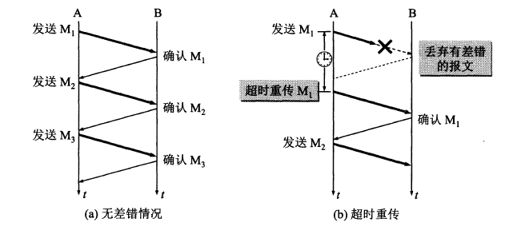
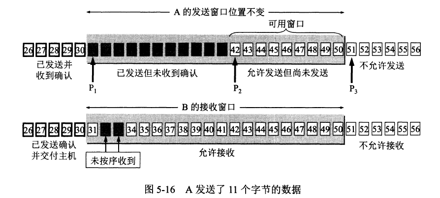

# TCP如何做到传输的可靠性的

TCP发送的报文是通过网络层（IP层）传送的，但是网络层只能提供尽最大努力服务，即TCP下面的网络所提供的是不可靠的传输。

理想的传输条件有以下两个特点：
1. 传输信道不产生差错。
2. 不管发送方以多快速的速度发送数据，接收方总是来得及处理收到的数据。

这样的条件在实际网络中是不具备，因此，我们必须使用一些可靠传输协议，当出现差错是让发送发重传出现差错的数据，同事在接收方来不及处理
收到的数据的时候，及时告知发送发适当降低发送数据的速度。这样来实现可靠的传输。

## 1停止等待协议

停止等待协议就是每次发送完一个分组之后就停止发送，等待对方确认，在收到确认后在发送下一个分组的数据。下面分三种情况分别说明传输的情况。

全双工通信的双方及时发送方也是接收方，此处假设A为发送方，B为接收方。

### 1.1 无差错情况

在无差错的情况下，如下图(a)所示，
 
1. A 发送分组 M1, 发送完就暂停,等待 B 确认
2. B 收到分组M1, 向A发送M1的确认
3. A 收到M1的确认，继续发送M2

无差错的情况下，按照上述步骤进行发送。那么发送出现错误，B 收不到消息呢？

### 1.2 发送方消息丢失

如果出现差错，A 在发送给 B 的消息丢失，B 没有收到，如上图(b) 所示。那么 A 就会收不到 来自B的确认

这种情况，A 的超时计时器就会在超时之后重新传M1

**因为有以上的超时重传操作，所有需要注意3点**
1. A 个发送完一个分组的数据之后，需要保存一下数据副本（重传时候用），等到收到确认后再删除。
2. 分组和确认分组需要编号，这样才能清楚哪些收到，哪些没有收到
3. 超时计时器的时间设置应当比数据分组传输的平均值更长一点。

**上面是考虑的B没有收到的情况，那如果是 B的确认丢了，或者B收到的A的分组比较晚（B的确认比较晚）的情况，会触发重传，这个该怎么处理呢 ？** 

### 1.3 确认丢失和确认迟到

如图5-10(a) 所示。B的M1确认丢失，A 由于没有收到B的M1确认，就是在超时时候进行重传M1。此时B的操作点上需要注意两点：

1. 丢弃这个重复分组M1, 不向上层传递。
2. 继续向A发送M1的确认，因为A重传的原因就是没有收到确认导致的。

如图5-10(b) 所示, 就是迟到的情况，B的操作是一样，收到分组就发送确认，重复分组数据就丢弃。这种情况下，A 可能由于迟到的确认导致收到重复的确认，
这种情况下，A直接丢弃重复的确认信息即可。

最极端的情况是 A一直发送，但是B一直没有确认， 这种基本就是代表信道不可用了。

### 1.4 信道利用率

关于信道利用率这里不详细说明，就这给结论，停止等待协议的效率不高，应为需要等待确认，就成了一个线性的。而使用流水线传输就可以提到利用率

给两张图对比一下

**如果要使用流水线传输，就需要用到`连续ARQ协议`和`滑动窗口协议了`**

## 2连续ARQ 协议

连续ARQ，通过使用滑动窗口，来提供信道利用率，在窗口内的数据，未收确认的情况下，仍然可以持续发送，当收到***按序*的确认后，窗口向前移动

**这里有个问题：**

滑动收到确认后向前移动，但接收窗口内的分组到达顺序不一定是顺序的，中间分组先到的话，该怎么回复确认？发送窗口有改如何移动呢？
要得到这个问题的答案，我们先看看实际TCP传输实现上怎么做的就明白了。

## 3可靠传输的实现

TCP的可靠传输主要通过滑动窗口来实现，下面先来看看滑动窗口的实现。

### 3.1滑动窗口

**1.滑动窗口示例：**

如上图，通过三个指针 p1, p2 ,p3 可以描述一个发送窗口(A的发送窗口)的状态

- 小于p1 表示已发送并已经收到确认的数据
- 大于p3 表示不允许发送的数据
- p3-p1 表示发送窗口大小
- p2-p1 表示已经发送但为收到确认的数据
- p3-p2 表示允许被发送但是尚未发送的数据（有被叫做 `可用窗口` 或者 `有效窗口`）

而上图中B的接收窗口，在上图的情况下， B **未按序**收到了32 33，但是 31 没有收到，因此 B 把这个数据缓存起来，回复31给 A。

**为什么是回复31呢？**

因为B只能按照**按序确认的最高序号**来回复，当前最高按序确认的是30，所以只能回复31。

上面的情况，当B收到31之后，再确认的时候就可以回复34了，而A在收到确认的时候就可以向前移动3格了。

**2.滑动窗口与缓存的关系**

1. 发送缓存用来暂时存放的数据：
  - 发送应用程序传送给发送方TCP准备发送的数据
  - TCP已经发送出尚未收到确认的数据
2. 接收缓存用来暂时存放的数据：
  - 按序到达但尚未被接收应用程序读取的数据
  - 未按序到达的数据

**以上需要注意三点：**

1. A的发送窗口是根据B的接收窗口大小设置的，但是在同一时刻，A的发送窗口和B的接收窗口大小不一定一样。
2. 对于不按序到达的数据，如果字节丢弃，就会造成很多重传。因此，使用缓存先保留，等到确实的字段到达后一起交付上层应用进程。
3. 接收方可以使用累积确认的功能，等到合适时候，在把去人在发送数据是一起确认。（实际使用少）

### 3.2超时重传时间的选择

超时重传的时间选择问题，TCP采用的是自适应算法，记录报文发送的时间和相应的确认时间，这个时间差就是一个往返时间RTT。通过RTT的加权平均值(RTTs)得到最终的超时重传时间（RTO）
计算公式就不在这里说了，有想去的朋友可以网上查询下。

但是上面的算法在重传的情况下 会导致对确认分不清是首次的确认还是重传的确认，进而导致在技术RTT的时候失去准确性。

针对上面的问题最终的做法是：报文每重传一次，就把RTO增大为原来的2倍，当不在发生重传的时候，使用正常的计算公式计算RTO

## 4总结

TCP如何实现的可靠传输的？（为什么TCP传输是可靠的？），总结如下：

1. 技术停止等待，通过确认的方式确保数据传送的成功
2. 增加超时重传的方式，处理未确认的数据和迟到的确认数据进行重传或者丢弃
3. 使用滑动窗口的方式，增加信道的利用率，提升发送效率。
4. 通过缓存减少不必要的重传。
5. 所有的确认是取**按序接收**的最大序列号来计算的。
6. 通过自适应的RTO，提升利用率，减少不必要的等待和不必要的超时导致的重传。

通过上述方式，基本确保了可靠传输。