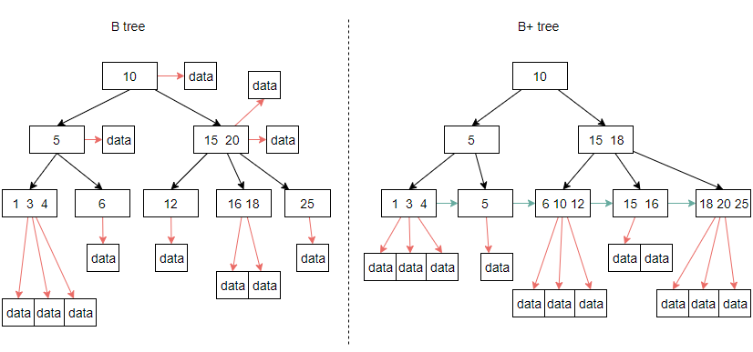

# MySQL索引的数据结构

要搞懂为什么数据库所用要使用b+tree？或者说为什么没有使用b-tree或者其他数据结构，
那么首先一点要搞清楚常见的数据结构特定（调研）和数据库操作时候经常需要的场景（即，需求）。再结构来谈为什么，就比较容易理解了。

## 1 常见二叉树定义及其特性

关于常见的树结构的定义和特点，[点击查看详细](common/data-structure/tree.md)

这里简单说明一下：

- 二叉排序树：查找平均时间复杂度O(log(n)), 最坏O(n), 新增、删除的时候会失衡，导致查询效率变低 
- 平衡二叉树：查找平均时间复杂度O(log(n)), 新增、删除的时候会使用平衡算法重新平衡
- Btree: 查找平均时间复杂度O(log(n)), 新增、删除的时候会使用平衡算法重新平衡，和平衡二叉树相比为多叉树。叶子节点和非叶子节点都存储Key、向下指针和数据。
- B+tree: 查找平均时间复杂度O(log(n)), 新增、删除的时候会使用平衡算法重新平衡，在btree的基础上，叶子节点只存储Key、向下指针。叶子节点存储数据，且以链表连接起来。

Btree 和 B+tree存储结构示例对比图：

## 2 B+tree在索引中的使用 

1. 分析mysql索引结构的需求
 - mysql作为数据库存储工具，经常需要按照关键字搜索
 - mysql需要一些返回查找，如 > < 等

2. B+tree和btree作为索引结构的对比
  - 使用b+tree, 有与非叶子结点只存储指针，相比非叶子节点存储数据的btree, 节省了索引空间。（但是查询可能没有btree快速，例如 查询的数据在btree的非叶子节点直接获取到）
  - 使用b+tree, 遍历整个数据集方便，只需要遍历底部叶子节点组成的链表即可
  - 使用b+tree，有与数据全部在底部有序，可以按照范围查找。

## 3 聚集索引、二级索引 、覆盖索引

### 3.1 聚集索引（clustered index）

  - 每个InnoDBtable 都有一个称为clustered index的特殊索引，其中存储了行数据。通常，聚集索引与primary key同义。

  - 在 table 上定义PRIMARY KEY时，InnoDB会将其用作聚 Cluster 索引。如果没有逻辑唯一且非空的列或列集，
请添加一个新的auto-increment列，其值将自动填写。

  - 如果没有为 table 定义PRIMARY KEY，则 MySQL 将找到第一个UNIQUE索引，其中所有键列均为NOT NULL，
而InnoDB将其用作聚集索引。

  - 如果 table 没有PRIMARY KEY或合适的UNIQUE索引，则InnoDB在包含行 ID 值的合成列上内部生成名为GEN_CLUST_INDEX的隐藏聚集索引。
这些行由InnoDB分配给该 table 中的行的 ID 排序。行 ID 是一个 6 字节的字段，随着插入新行而单调增加。因此，按行 ID 排序的行实际上在插入 Sequences 上。

  - **通过聚集索引访问行是快速的，因为索引搜索直接导致包含所有行数据的页面。如果 table 很大，
则与使用不同于索引记录的页面存储行数据的存储组织相比，聚集索引体系结构通常可以节省磁盘 I/O 操作。**

图片源自：http://blog.codinglabs.org/articles/theory-of-mysql-index.html， 图8

### 3.2 二级索引（secondary indexes）

除聚集索引以外的所有索引都称为secondary indexes。在InnoDB中，辅助索引（二级索引）中的每个记录都包含该行的主键列以及为该辅助索引指定的列。 
InnoDB使用此主键值在聚集索引中搜索行。

图片源自：http://blog.codinglabs.org/articles/theory-of-mysql-index.html， 图11

### 3.3 覆盖索引

如果索引的叶子节点中已经包含了要查询的数据，那么就没有必要再回表查询，这种一个索引包含（或者说覆盖）所有需要查询的字段的值的索引，我们称之为覆盖索引。

详细举例：https://www.cnblogs.com/myseries/p/11265849.html

---

更加详细的索引知识 [点击查看](mysql-idx.md)

--- 

参考资料

- [为什么选择B+树作为数据库索引结构？](https://www.cnblogs.com/kkbill/p/11381783.html)
- [MySQL索引背后的数据结构及算法原理](http://blog.codinglabs.org/articles/theory-of-mysql-index.html)
- [再有人问你为什么MySQL用B+树做索引，就把这篇文章发给她](https://database.51cto.com/art/201911/605365.htm)
- [平衡二叉树、B树、B+树、B*树 理解其中一种你就都明白了](https://zhuanlan.zhihu.com/p/27700617)

  

  

