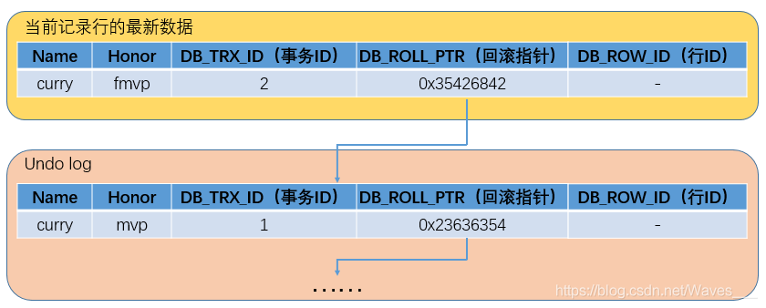

# MySQL的并发控制机制

上一篇文章 [MySQL的事务隔离级别与实现原理](004-mysql-transaction.md) 中分析了mysql并发情况下出现的 脏读(Dirty Read)、不可重复读(Non-Repeatable Read)、幻读(Phantom Read) 问题，
提到了事务隔离级别和实现原理，其中关于实现原理知识简单介绍了几种方式（锁、版本号、MVCC），这篇文章将详细介绍每种方式的实现。

## 1 基于锁实现并发控制

锁（Locking）是数据库在并发访问时保证数据一致性和完整性的主要机制。在 MySQL 中，不同存储引擎使用不同的加锁方式；
我们以 InnoDB 存储引擎为例介绍 MySQL 中的锁机制，其他存储引擎中的锁相对简单一些。

### 1.1 锁分类

MySQL 中的锁可以按照粒度分为锁定整个表的表级锁（table-level locking）和锁定数据行的行级锁（row-level locking）：

- 表级锁具有开销小、加锁快的特性；表级锁的锁定粒度较大，发生锁冲突的概率高，支持的并发度低；
- 行级锁具有开销大，加锁慢的特性；行级锁的锁定粒度较小，发生锁冲突的概率低，支持的并发度高。

InnoDB 存储引擎同时支持行级锁（row-level locking）和表级锁（table-level locking），默认情况下采用行级锁。

- 行级锁
  - 共享锁（S）:允许获得该锁的事务读取数据行（读锁），同时允许其他事务获得该数据行上的共享锁，并且阻止其他事务获得数据行上的排他锁。
  - 排他锁（X）:允许获得该锁的事务更新或删除数据行（写锁），同时阻止其他事务取得该数据行上的共享锁和排他锁。
- 表级锁
  - 意向共享锁（IS）:事务在给数据行加行级共享锁之前，必须先取得该表的 IS 锁。
  - 意向排他锁（IX）:事务在给数据行加行级排他锁之前，必须先取得该表的 IX 锁。

### 1.2 锁的实现

1. 关于表级锁实现；

>InnoDB 表存在两种表级锁，一种是LOCK TABLES语句手动指定的锁，另一种是由 InnoDB 自动添加的意向锁。

2. 行级锁的实现：

>InnoDB 通过给索引上的索引记录加锁的方式实现行级锁。具体来说，InnoDB 实现了三种行锁的算法：记录锁（Record Lock）、间隙锁（Gap Lock）和 Next-key 锁（Next-key Lock）。

- 记录锁（Record Lock）：记录锁（Record Lock）是针对索引记录（index record）的锁定。

记录锁永远都是锁定索引记录，锁定非聚集索引会先锁定聚集索引。如果表中没有定义索引，InnoDB 默认为表创建一个隐藏的聚簇索引，并且使用该索引锁定记录。

- 间隙锁（Gap Lock）：间隙锁（Gap Lock）锁定的是索引记录之间的间隙、第一个索引之前的间隙或者最后一个索引之后的间隙。

例如，SELECT * FROM t WHERE c1 BETWEEN 1 and 10 FOR UPDATE;会阻止其他事务将 1 到 10 之间的任何值插入到 c1 字段中，即使该列不存在这样的数据；因为这些值都会被锁定。

- Next-key 锁（Next-key Lock）：相当于一个索引记录锁加上该记录之前的一个间隙锁。和间隙锁的却别在与记录存在的话要加一个记录锁。

行锁分析请看 [通过各种简单案例，让你彻底搞懂 MySQL 中的锁机制与 MVCC](https://tonydong.blog.csdn.net/article/details/103324323)

## 2 MVCC实现并发控制
多版本控制（Multiversion Concurrency Control）: 指的是一种提高并发的技术。最早的数据库系统，只有读读之间可以并发，读写，写读，写写都要阻塞。
引入多版本之后，只有写写之间相互阻塞，其他三种操作都可以并行，这样大幅度提高了InnoDB的并发度。在内部实现中，InnoDB通过undo log保存每条数据的多个版本，
并且能够找回数据历史版本提供给用户读，每个事务读到的数据版本可能是不一样的。在同一个事务中，用户只能看到该事务创建快照之前已经提交的修改和该事务本身做的修改

MVCC在 Read Committed 和 Repeatable Read两个隔离级别下工作。

MySQL的InnoDB存储引擎默认事务隔离级别是RR(可重复读)，是通过 "行级锁+MVCC"一起实现的，正常读的时候不加锁，写的时候加锁。而 MVCC 的实现依赖：隐藏字段、Undo log、Read View。

### 2.1 隐藏字段

InnoDB存储引擎在每行数据的后面添加了三个隐藏字段：

1. **DB_TRX_ID(6字节)**：表示最近一次对本记录行作修改（insert | update）的事务ID。至于delete操作，InnoDB认为是一个update操作，不过会更新一个另外的删除位，将行表示为deleted。并非真正删除。

2. **DB_ROLL_PTR(7字节)**：回滚指针，指向当前记录行的undo log信息

3. **DB_ROW_ID(6字节)**：随着新行插入而单调递增的行ID。理解：当表没有主键或唯一非空索引时，innodb就会使用这个行ID自动产生聚簇索引。如果表有主键或唯一非空索引，聚簇索引就不会包含这个行ID了。这个DB_ROW_ID跟MVCC关系不大。

### 2.2 Undo log
Undo log中存储的是老版本数据，当一个事务需要读取记录行时，如果当前记录行不可见，可以顺着undo log链找到满足其可见性条件的记录行版本。

大多数对数据的变更操作包括 insert/update/delete，在InnoDB里，undo log分为如下两类：
1. **insert undo log** : 事务对insert新记录时产生的undo log, 只在事务回滚时需要, 并且在事务提交后就可以立即丢弃。
2. **update undo log** : 事务对记录进行delete和update操作时产生的undo log，不仅在事务回滚时需要，快照读也需要，只有当数据库所使用的快照中不涉及该日志记录，对应的回滚日志才会被purge线程删除。

>Purge线程：为了实现InnoDB的MVCC机制，更新或者删除操作都只是设置一下旧记录的deleted_bit，并不真正将旧记录删除。
>为了节省磁盘空间，InnoDB有专门的purge线程来清理deleted_bit为true的记录。purge线程自己也维护了一个read view，
>如果某个记录的deleted_bit为true，并且DB_TRX_ID相对于purge线程的read view可见，那么这条记录一定是可以被安全清除的。

### 2.3 Read View

Read View(读视图)，相当于快照、snapshot的意思。

Read View 主要用来判断可见性，其保存了“对本事务不可见的其他活跃事务”。其中有几个关键的值（对理解可见性非常重要）：

1. **trx_ids**: Read View 创建时的其他未提交的活跃事务ID列表，意思就是创建Read View时，将当前未提交的其他事务ID记录下来。
2. **low_limit_id**: 目前出现过的最大事务id+1, 即下一个未被分配的事务id。
3. **up_limit_id**: 活跃事务列表trx_ids中最小的事务ID，如果trx_ids为空，则up_limit_id 为 low_limit_id。

关于Read View的生成

1. 在innodb中的Repeatable Read级别, 只有事务在begin之后，执行第一条select（读操作）时, 才会创建一个快照(read view)，
将当前系统中活跃的其他事务记录起来；并且事务之后都是使用的这个快照，不会重新创建，直到事务结束。
2. 在innodb中的Read Committed级别, 事务在begin之后，执行每条select（读操作）语句时，快照会被重置，即会重新创建一个快照(read view)。

### 2.4 记录行修改的流程

记住上面的几个概念之后，下面说明下在记录行被修改的时候，具体流程如何（直接引用的 https://blog.csdn.net/Waves___/article/details/105295060 中的示例，就不再画图了）

假设有一条记录行如下，字段有Name和Honor，值分别为"curry"和"mvp"，最新修改这条记录的事务ID为1。

1）现在事务A（事务ID为2）对该记录的Honor做出了修改，将Honor改为"fmvp"：
- ①事务A先对该行加排它锁
- ②然后把该行数据拷贝到undo log中，作为旧版本
- ③拷贝完毕后，修改该行的Honor为"fmvp"，并且修改DB_TRX_ID为2（事务A的ID）, 回滚指针指向拷贝到undo log的旧版本。（然后还会将修改后的最新数据写入redo log）
- ④事务提交，释放排他锁

结果如下图：

（2） 接着事务B（事务ID为3）修改同一个记录行，将Name修改为"iguodala"：
- ①事务B先对该行加排它锁
- ②然后把该行数据拷贝到undo log中，作为旧版本
- ③拷贝完毕后，修改该行Name为"iguodala"，并且修改DB_TRX_ID为3（事务B的ID）, 回滚指针指向拷贝到undo log最新的旧版本。
- ④事务提交，释放排他锁

结果如下图：

从上面可以看出，不同事务或者相同事务的对同一记录行的修改，会使该记录行的undo log成为一条链表，
undo log的链首就是最新的旧记录，链尾就是最早的旧记录。 

### 2.5 可见性比较算法

在innodb中，创建一个新事务后，执行第一个select语句的时候，innodb会创建一个快照（read view），
快照中会保存系统当前不应该被本事务看到的其他活跃事务id列表（即trx_ids）

先定义几个概念：
1. “当前事务”：要读取某一个记录行的事务
2. trx_id：被读取的记录行里面的 DB_TRX_ID的值

那么可见性算法如下：

- **步骤1**. 如果 trx_id < up_limit_id 说明 该记录行中记录的事务 在“当前事务”创建快照之前已经提交，所以该记录行对 “当前事务” 是可见的。
- **步骤2**. 如果 trx_id >= low_limit_id 说明 该记录行中记录的事务 在“当前事务”创建快照之后提交的，所以该记录行对 “当前事务” 是不可见的。
- **步骤3**. 如果 up_limit_id <= trx_id < low_limit_id, 表明 该记录行中记录的事务 在“当前事务”创建快照的时候可能处于“活动状态”或者“已提交状态”；所以就要对活跃事务列表trx_ids进行查找
  - 如果在活跃事务列表trx_ids中能找到 id 为 trx_id 的事务，表明 1 在“当前事务”创建快照前，“该记录行的值”被“id为trx_id的事务”修改了，但没有提交；或者2 在“当前事务”创建快照后，
  “该记录行的值”被“id为trx_id的事务”修改了（不管有无提交）；这些情况下，这个记录行的值对当前事务都是不可见的，跳到步骤4；
  - 在活跃事务列表中找不到，则表明“id为trx_id的事务”在修改“该记录行的值”后，在“当前事务”创建快照前就已经提交了，所以记录行对当前事务可见，跳到步骤5。
- **步骤4**. 在该记录行的 DB_ROLL_PTR 指针所指向的undo log回滚段中，取出最新的的旧事务号DB_TRX_ID, 将它赋给trx_id，然后跳到步骤1重新开始判断。
- **步骤5**. 将该可见行的值返回。

### 2.6 示例 

下面给出一个示例，配合理解

假定原始数据如下：

|field|DB_ROW_ID|DB_TRX_ID|DB_ROLL_PTR|
|---|----|---|----|
|0	|10	 |10000	|0x13525342

示例1：

示例2：

## 3 业务加乐观锁控制

业务上加乐观锁的方式就是上一篇[MySQL的事务隔离级别与实现原理](004-mysql-transaction.md)提到时间戳方式的思想，
通过在业务表中显示定义一个version字段，在操作的时候在借用java锁的思想，通过CompareAndSet的方式，以自旋锁方式操作数据。

此处就不展开说明了，实现上原理还是比较好理解的。

---

参考链接：

- [通过各种简单案例，让你彻底搞懂 MySQL 中的锁机制与 MVCC](https://tonydong.blog.csdn.net/article/details/103324323)
- [MySQL中MVCC的正确打开方式（源码佐证）](https://blog.csdn.net/Waves___/article/details/105295060)
- [浅谈数据库并发控制 - 锁和 MVCC](https://draveness.me/database-concurrency-control/)
- [MySQL-InnoDB-MVCC多版本并发控制](https://segmentfault.com/a/1190000012650596)