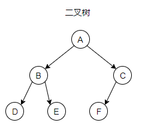
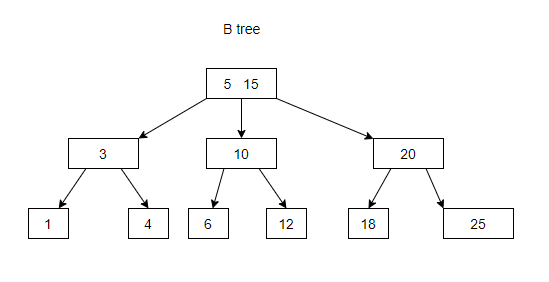
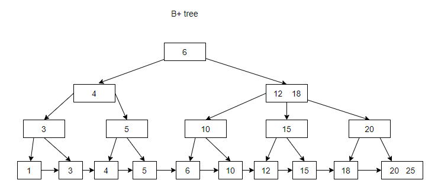
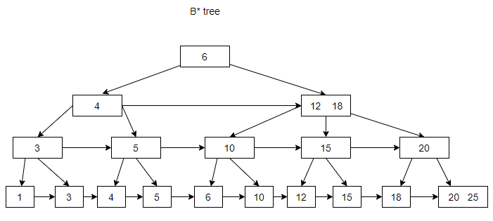

# 树 - 常见的树型结构分析

- 二叉树(最多两个子节点)
  - 满二叉树 (全部都是两个子节点)
  - 完全二叉树 (除了最下层外都是全满，而最下层所有叶结点都向左边靠拢填满)
- 二叉排序树/二叉查找树(左边比右边小/大)
- 平衡二叉树 (所有子树高度差为1)
  - AVL树  旋转达到平衡（自平衡）
- 2-3树
- B tree
  - B树
  - B+树 (为什么mysql索引要使用B+树而不是B树)
  - B*树
- Trie树
- 红黑树

## 二叉树

- **二叉树的定义**：二叉树的每个结点至多只有二棵子树(不存在度大于2的结点)，二叉树的子树有左右之分，次序不能颠倒。
二叉树的第i层至多有2i-1个结点；深度为k的二叉树至多有2k-1个结点；
对任何一棵二叉树T，如果其终端结点数为n0，度为2的结点数为n2，则n0=n2+1。

如图，二叉树示例

## 二叉查找树

- **二叉查找树定义**：又称为是二叉排序树（Binary Sort Tree）或二叉搜索树。二叉排序树或者是一棵空树，或者是具有下列性质的二叉树：
  - 若左子树不空，则左子树上所有结点的值均小于它的根结点的值；
  - 若右子树不空，则右子树上所有结点的值均大于或等于它的根结点的值；
  - 左、右子树也分别为二叉排序树；
  - 没有键值相等的节点。

- **二叉查找树的性质**：对二叉查找树进行中序遍历，即可得到有序的数列。

- **二叉查找树的时间复杂度**：它和`二分查找`一样，插入和查找的时间复杂度均为`O(logn)`，但是在最坏的情况下仍然会有`O(n)`的时间复杂度。
原因在于插入和删除元素的时候，树没有保持平衡（比如下图右边，我们查找8时候，相当于链表的O(n)查询了）。
我们追求的是在最坏的情况下仍然有较好的时间复杂度，这就是平衡查找树设计的初衷。

!>总结如下
1. 二叉查找树适合快速查找，时间复杂度平均为`O(logn)`，极端情况为`O(n)`
2. 二叉查找树的高度决定了二叉查找树的查找效率。
3. 二叉查找树在做插入和删除的时候，会影响树的平衡，最终导致查询效率变化（可能变坏）。

## 平衡二叉树

一般的二叉搜索树（Binary Search Tree），其期望高度（即为一棵平衡树时）为log2n，其各操作的时间复杂度O(log2n)同时也由此而决定。
但是，在某些极端的情况下（如在插入的序列是有序的时），二叉搜索树将退化成近似链或链，此时，其操作的时间复杂度将退化成线性的，即O(n)。
我们可以通过随机化建立二叉搜索树来尽量的避免这种情况，但是在进行了多次的操作之后，由于在删除时，我们总是选择将待删除节点的后继代替它本身，
这样就会造成总是右边的节点数目减少，以至于树向左偏沉。这同时也会造成树的平衡性受到破坏，提高它的操作的时间复杂度。于是就有了我们下边介绍的平衡二叉树。

- **平衡二叉树定义**：平衡二叉树（Balanced Binary Tree）又被称为AVL树（有别于AVL算法），且具有以下性质：
  - 它是一棵空树或它的左右两个子树的高度差的绝对值不超过1，
  - 左右两个子树都是一棵平衡二叉树。

平衡二叉树的常用算法有红黑树、AVL树等。通过在插入和删除时候，对二叉树进行调整，达到平衡，[点击查看平衡处理](https://www.cnblogs.com/maybe2030/p/4732377.html)。
在平衡二叉搜索树中，我们可以看到，其高度一般都良好地维持在O(log2n)，大大降低了操作的时间复杂度。

!>总结如下
1. 平衡二叉树适合快速查找，时间复杂度平均为`O(logn)`
2. 平衡二叉树的高度决定了二叉查找树的查找效率。
3. 平衡二叉树在做插入和删除的时候，会进行调整达再次达到平衡，从而保持查询时间复杂度。
4. 由于需要在插入删除时候需要调整以达到平衡，所有构建需要时间。

## 2-3树
在说明btree之前，先简单说明一下2-3树

2-3树是二叉查找树的一种变种，2和3分别代表2-节点和3-节点

- 2-节点:即普通的节点，包含1个元素，2条链
- 3-节点:为扩充版，包含2个元素，3条链，元素A, B 将数据划分为 x < A, A <= x < B, B < x 三段（三条链）

图解2-3树

btree 和 b+tree 红黑树 都是这个基础上演化出的。

## Btree

### B tree

B树和平衡二叉树稍有不同的是B树属于多叉树又名平衡多路查找树（查找路径不只两个）

规则：
1. 排序方式：所有节点关键字是按递增次序排列，并遵循左小右大原则；
2. 子节点数：非叶节点的子节点数>1，且<=M ，且M>=2，空树除外（注：M阶代表一个树节点最多有多少个查找路径，M=M路,当M=2则是2叉树,M=3则是3叉）；
3. 关键字数：枝节点的关键字数量大于等于ceil(m/2)-1个且小于等于M-1个（注：ceil()是个朝正无穷方向取整的函数 如ceil(1.1)结果为2);
4. 所有叶子节点均在同一层、叶子节点除了包含了关键字和关键字记录的指针外也有指向其子节点的指针只不过其指针地址都为null对应下图最后一层节点的空格子;

当按照以下数据插入数据的时候，产生的btree如下图：

数据 `1，3，4，5，6，10，12，15，18，20，25`

### B+ tree

B+ tree在 B tree的基础之上，非叶子节点只存储关键字和指针，叶子阶段存储数据，并且有执向右侧节点的指针

当按照以下数据插入数据的时候，产生的b+tree如下图：

数据 `1，3，4，5，6，10，12，15，18，20，25`

### B* tree

B* tree是在B+ tree的基础上，对非叶子节点加上右侧指针形成

## Trie树（单词查找树）

**特点**

每个结点都含有R条链接，其中R为字母表的大小。（单词查找树一般都含有大量的空链接，因此在绘制一颗单词查找树时一般会忽略空链接。）

树中的每个结点中不是包含一个或几个关键字，而是只含有组成关键字的符号。例如，若关键字是数值，则结点中只包含一个数位；若关键字是单词，则结点中只包含一个字母字符。我们将每个键所关联的值保存在该键的最后一个字母所对应的结点中。

**示例**

加入如下关键字
(zhao, qian, sun, li , zhou, wu, zheng, wang)

## 红黑树

红黑树的本质是对2-3查找树的改进，它能用一种统一的方式完成所有变换。

### 红黑树与2-3树的关联

红黑树背后的思想是用标准的二叉查找树（完全由2-结点构成）和一些额外的信息（替换3-结点）来表示2-3树。

我们将树中的链接分为两种类型：
- 黑链接则是2-3树中的普通链接
- 红链接将两个2-结点连接起来构成一个3-结点.确切地说，我们将3-结点表示为由一条左斜的红色链接相连的两个2-结点。

*以下图解(执向自己的指针为红色，在红黑树里面就代表自己的是红色节点，具体看后面的红黑树的颜色)*

红黑树都既是二叉查找树，也是2-3树。
（2-3树的深度很小，平衡性好，效率高，但是其有两种不同的结点，实际代码实现比较复杂。
而红黑树用红链接表示2-3树中另类的3-结点，统一了树中的结点类型，使代码实现简单化，又不破坏其高效性。）

### 红黑树的颜色
因为每个结点都只会有一条指向自己的链接（从它的父结点指向它），
我们将链接的颜色保存在表示结点的Node数据类型的布尔变量color中（若指向它的链接是红色的，那么该变量为true，黑色则为false）。

!>当我们提到一个结点颜色时，我们指的是指向该结点的链接的颜色。

### 红黑树的另一种定义
红黑树的另一种定义是满足下列条件的二叉查找树：
1. 红链接均为左链接。
2. 没有任何一个结点同时和两条红链接相连。
3. 该树是完美黑色平衡的，即任意空节点到根结点的路径上的黑链接数量相同。

---

参考资料：
- [[Data Structure] 数据结构中各种树](http://www.cnblogs.com/maybe2030/p/4732377.html)
- [【经典数据结构】B树与B+树](https://www.cnblogs.com/vincently/p/4526560.html)
- [数据结构-平衡二叉树（AVL Tree）](https://blog.csdn.net/juanqinyang/article/details/51418863)
- [二叉树（BST树）内结点的删除（3种情况全解）](https://blog.csdn.net/zxnsirius/article/details/52131433)
- [深度优先搜索和广度优先搜索的区别](https://www.zhihu.com/question/28549888)
- [二叉树的几种遍历递归与非递归java实现](https://blog.csdn.net/zlp1992/article/details/51406067)
- [教你透彻了解红黑树](https://github.com/julycoding/The-Art-Of-Programming-By-July/blob/master/ebook/zh/03.01.md)
- [清晰理解红黑树的演变---红黑的含义(从2-3树到 红黑树)](https://www.cnblogs.com/Chary/p/12217604.html)

{{comment}}

