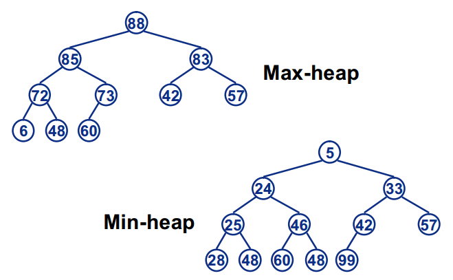

# 1 堆的定义

Heap是一种数据结构具有以下的特点：

1. **完全二叉树**；
2. heap中存储的值是**偏序**；

**小根堆（Min-heap）**: 父节点的值小于或等于子节点的值；

**大根堆（Max-heap）**: 父节点的值大于或等于子节点的值；

<!-- more -->

*备注：完全二叉树 即 除了最下层外都是全满（两个子节点），而最下层所有叶结点都向左边靠拢填满的二叉树*

示例：

# 2 堆的基本操作

## 2.1 堆的存储 

一般都用数组来表示堆，i 结点的父结点下标就为(i–1)/2。它的左右子结点下标分别为2 * i + 1和2 * i + 2。如第0个结点左右子结点下标分别为1和2。

## 2.2 堆的插入（创建）

插入一个元素：新元素被加入到heap的末尾，然后更新树以恢复堆的次序。
每次插入都是将新数据放在数组最后。可以发现从这个新数据的父结点到根结点必然为一个有序的数列，现在的任务是将这个新数据插入到这个有序数据中——这就类似于直接插入排序中将一个数据并入到有序区间中。

## 2.3 堆的删除

按定义，堆中每次都删除第0个数据。为了便于重建堆，实际的操作是将最后一个数据的值赋给根结点，然后再从根结点开始进行一次从上向下的调整。调整时先在左右儿子结点中找最大的，如果父结点比这个最小的子结点还大说明不需要调整了，反之将父结点和它交换后再考虑后面的结点。相当于从根结点将一个数据的“下沉”过程。

---

参考资料：

- [数据结构——堆（Heap）大根堆、小根堆](https://www.cnblogs.com/wangchaowei/p/8288216.html)

