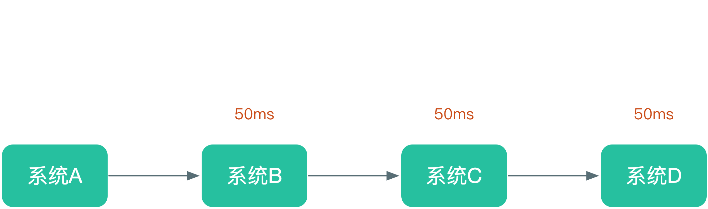

# 分布式：消息队列的使用方案

研究消息系统，从三个问题出发
1. W(what) 什么是消息系统
2. W(why) 为什么要使用消息系统
3. H(how) 怎么使用消息系统

## 什么是消息系统

**生产者消费者模式**

- Producer：消息生产者，负责产生和发送消息到 Broker；
- Broker：消息处理中心。负责消息存储、确认、重试等，一般其中会包含多个 queue；
- Consumer：消息消费者，负责从 Broker 中获取消息，并进行相应处理

## 为什么使用消息系统

选择使用消息系统，我们需要先思考两个问题，1.为什么要使用消息系统？ 2.使用消息系统会有什么优缺点？

先来说说第一个问题，为什么使用消息系统。综合来看的话，消息系统，最终达到的就是 **解耦**、**异步**、**削峰** 的目的

### 利用消息系统来解耦系统

**传统模式**

*传统模式的缺点*
  - 传统模式的缺点显而易见，每次有新的业务接入的手，都需要原有的业务代码进行修改，业务耦合很严重

**中间件模式**

*中间件模式好处*
  - 使用中间模式可以完美的避免掉之前传统的模式高耦合的缺点，如果有新的业务接入，原有的系统基本很少需要改动，只要待接入的系统订阅相关的消息进行处理就可以

**典型示例：**

例如用户【订单状态】发生改变的时候，相关的【库存系统】、【发货系统】做出相应表现

一段时间后，产品要求订单状态发生变更的时候，需要发送短信，【短信系统】这个时候就需要接入。

*传统模式下*，【订单系统】通过RPC调用对应的 【库存系统】、【发货系统】 相关代码，当再次接入短信提醒的时候，改动【订单系统】的代码，调用【短信系统】的RPC接口

*中间件模式下*，只需要 【库存系统】、【发货系统】、【短信系统】 各自订阅 【订单系统】的 订单状态变更的消息即可，收到消息，各自按照各自逻辑处理业务即可。

### 利用消息系统来异步操作

**传统模式**

*传统模式的缺点*
  - 传统模式下，业务代码线性执行，耗时是各业务系统耗时的总和，最终导致整个系统处理能力下降

**中间件模式**

*中间件模式好处*
  - 使用中间模式可以使一些分非必须线性执行的业务系统并行的处理业务，降低整个业务系统的处理耗时，提升整体处理能力

**典型示例**

还是如上面的订单的业务场景

*传统模式下*，更新库存和发送短信 线性执行。

*中间件模式下*，更新库存的同时就可以发送订单通知的短信。两者同时进行。

### 利用消息系统来削峰

**传统模式**

*传统模式的缺点*
  - 传统模式下，请求通过网关进入之后，由业务系统处理之后返回，正常情况没有问题，如果一旦某个时间，请求量暴增。达到业务系统处理能力阀值
    这个时候，后续的请求都会出现异常，业务系统也高负荷运转。

**中间件模式**

*中间件模式好处*
  - 使用中间模式下，在业务系统和网管之间加入一个消息中间件层，请求进入网关后，转交给消息系统，并提前返回业务中间态。业务订阅消息，按照系统本身处理能力消费
    消息中间件中累积的请求，达到消除峰值目的。所有请求都不会丢失，都有处理。

**典型示例**

还是如上面的订单的业务场景

*传统模式下*，当出现大量的用户的下单请求的时候，超出业务系统阀值的请求，系统肯定处理不了，这些请求肯定处理异常，用户下单失败

*中间件模式下*，当大量的请求过来的时候，这些请求被转存到消息系统，并返回中间状态，下单中。业务系统再从消息中间件中获取请求并处理，保证所有请求被正常处理。
应对这种突增的峰值问题，使用消息中间件可以很好的解决。

### 消息系统带来的缺点

使用消息系统之后，虽然有很多优点，但是万事都有弊端，没有绝对完美的解决方案，我们能够做到就是找到最适合自己的解决方案。

引入消息系统，带来的缺点，可以从两个方面考虑

1. **系统可用性**：消息系统虽然可以 解耦、异步、削峰，但是同样的也会降低系统的可用性。怎么解释呢？加入了消息系统的架构，很明显的一点就是，如果消息系统出现问题，会很明显
的造成服务挂掉。那么，保证在消息系统的可用性，就是一个非常关键问题

2. **系统复杂性**：使用消息系统后，由于其异步操作的特点，那么如何保证消息的顺序？消息是否被重复消费？消息丢失 等问题，就我们必须在设计系统的时候必须要考虑的问题

当决定引入消息系统的时候，针对的消息系统的确定，我们也需要有自己的方案。下面，就以已下四个问题来展开说明，如何优雅的使用消息系统。

## 如何保证消息队列是高可用的？

上面提到过，使用了消息系统之后会降低系统的可用性，一旦消息系统挂了，整个服务就挂了。这种情况在生产环境是绝对不允许的，因此生产环境一般不会使用单机模式部署消息系统。

通常为了保证消息系统本身的可靠性，会采用集群部署的方式。实现集群的方式基本都是差不多，一个服务发现中心，一个消息服务集群（master-slave 或者 leader模式）。架构一般如下：

- **Server集群**：不管是分布式RPC服务集群，还是消息服务集群，差不多都是如此。 例如， dubbo的注册中心，kafka的broker, rocketMQ的broker

- **Monitor集群**： monitor集群一般用来做服务维护的，一般作用是注册服务中心并做服务的master选举作用，常见的dubbo架构的注册中心，kafka的zookeeper中心，当然kafka的zookeeper
还有存储数据、维护消息的作用。

参考：
- [dubbo架构图](http://dubbo.apache.org/zh-cn/docs/user/preface/architecture.html)
- [kafka架构图](https://zhuanlan.zhihu.com/p/38269875)
- [redis集群部署](http://www.yunweipai.com/archives/20444.html)

## 如何保证消息可靠性？

消息传输可靠性的讨论，涉及到消息交付的语义的定义

- At most once——消息可能会丢失但绝不重传。
- At least once——消息可以重传但绝不丢失。
- Exactly once——这正是人们想要的, 每一条消息只被传递一次.

各种消息系统中间件，都会针对语义做一些处理。那么我们在来保证消息传输的可靠性，但是应用中对同一个消息发送失败、重复、乱序怎么处理呢？这些应用系统导致的问题，消息系统本身是无法知晓的，这些就需要我们业务系统本身做好控制。

### 消息丢失怎么办？

通过我们在使用消息的时候，都是期望 Exactly once 方式的，但是消息丢失的情况在实际中总会发生，那么如果解决呢？

1. 生产者丢消息, 消息队列没有接收到消息，该如何处理
  
   关于生产者丢掉消息的问题，最常见的方式就是生产者把生产的消息做本地化处理，成功之后，发送给消息中间件。等待中间件的确认（很多中间件支持这个API，例如kafka）。收到成功确认之后，认为发送成功。收到失败确认时，拿出本地的消息再次发送，或实时重发、或者延迟再发、或跑批处理。

2. 消费者没有收到消息，消息队列没有转发或者转发的消息丢失，改如何处理
  
   如果消息已经到达中间，在消费的时候没有消费到，这种的处理，跟各个中间件的设计有关。可以利用各自的特点来实现，例如 kafka中，可以通过调整消费的offset的位子来达到消费之前没有消费到消息的目的。

### 如何保证消息的顺序性？

当消费者这边对消息的处理不是幂等，或者消息的先后，直接会影响最终的结果的时候，消息的顺序就是必须要考虑的问题。

例如：订单状态的更新，订单状态的轮转有些状态是不可逆的，如从【撤销】到【创建】这种变化是觉得不允许的，但是如果【创建】的消息比【撤销】的消息后到，最终处理撤销消息的时候，系统是不是就会有问题？

针对这种消息顺序敏感的系统，可以从以下及个方面去考虑解决方案

1. 消息生产环节
  
   生产者生成消息时候做业务检测，例如 上例中，订单状态转换是有顺序，有些状态是不可逆的，如果遇到这可逆向的状态变更，可以认为此次请求是非法而不予处理。

   生成者保证同一类消息在同一个队列（例如：topic，kafka中吧相同详细根据key值路由到同一个partition）中，利用队列保证消息的顺序。例如上例中，订单状态更新应该在一个队列，而不能设计每中状态变化一个队列（虽然根据状态不能分开队列可以负载均衡，但是个人觉得不太可取，会破坏消息的顺序。例如，【创建消息】 和 【撤销消息】分为两个队列，大多数业务，创建比撤销的多，那么中间件中积压的创建消息多，撤销消息少，消费的时候，必然可能存在撤销先消费到。单此时订单都还创建，订单系统处理时候就有问题了）

2. 消息发送环节
  
   我们在使用消息的时候，很多时候都是广播的方式。那么消息的传递应该是一个树形，而不该是一个环形。(这里消息可能不是用一个消息，但是在业务上是同一个时间触发。)
   
   
   如果消息是环形的，最终的节点就需要监听来自两个地方的不同的消息。以哪个为主，就变得很疑惑了，或者等两个消息都到达，这个等待就加大了消费者的处理难度。

3. 消息消费环节

   消费者保证消费的队列正确性，利用队列保存顺序。
   
   消费者在保证消息顺序的时候，其实和生成者类似，根据业务确定，能设计成幂等性的消费的话最好，不能的时候，根据业务确定当前消息不合理，不处理。

### 如何保证消息不被重复消费?

消息重复消费，在不支持幂等性的业务中，会导致很大的问题。其产生的原因 可能是消息生成了多次，也可能是消费者多次消费。业务系统需要从生成消息和消费消息两个环节进行控制

1. 消息生成的时候如何不重复生成消息
  
   生产者可以根据业务特点设置消息唯一ID，发送前检测该ID的消息是否发送过。例如。 订单状态例子中， 利用 【单号 + 状态值】组合生成一个消息ID，就可以避免重复生成消息并发送。

2. 消息消费的时候，同样的消息如何不重复消费（单个消费者，多个消费者）
  
   当中间件中的消息是唯一的时候，消费可能由于某些原因重复进行了消费，要保证不重复消费，需要分为单个消费者和多个消费者来看
   
   对于单个消费者，从正确的队列获取消息，进行处理，可以本地判断消息ID是否处理过的方式确定，已处理过的消息不在处理。但是需要本地加上一个消息处理记录，处理失败的消息，需要存储，再次重试。加大接受消息的维护难度。

   多个消费者，大多数消息系统，会只让一个消费者或者消费者组消费，但是如果我们不同的组消费同一个消息呢，如果有类似需求，可以考虑对消息ID进行加锁控制，保证只有一个消费者消费。当确定了消费者之后，操作同单个消费者一样。

----

参考资料：

1. [分布式之消息队列复习精讲](https://mp.weixin.qq.com/s/rzEX0wQCoDBxuFmws9f7Lw)
2. [Kafka 设计与原理详解](https://blog.csdn.net/suifeng3051/article/details/48053965?spm=a2c4e.11153940.blogcont54747.3.57632bb2I0S4Hw)
3. [消息中间件你选对了吗？Kafka与RabbitMQ谁更胜一筹？](http://cmsblogs.com/?p=3846)
4. [Kafka史上最详细原理总结](http://www.thinkyixia.com/2017/10/25/kafka-2/)

