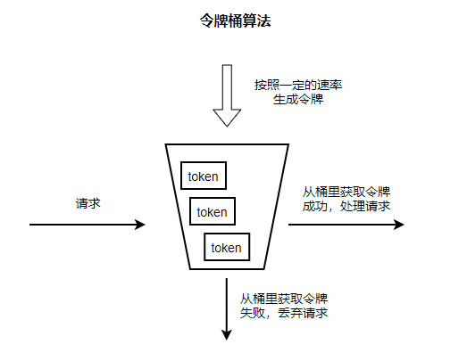
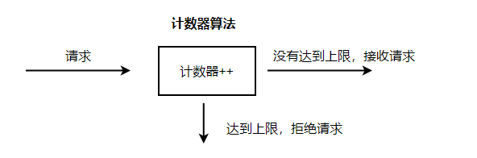
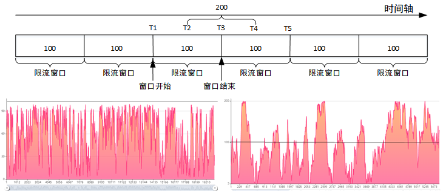

# 高并发：限流

处理高并发的三板斧：缓存、限流、熔断降级

本文将来接收下关于限流的那些事儿

## 1 认识限流

什么是限流？为什么要做限流？这两个问题的答案其实是一样的。

每个系统都有服务的上线，所以当流量超过服务极限能力时，系统可能会出现卡死、崩溃的情况，所以就有了降级和限流。限流其实就是：当高并发或者瞬时高并发时，为了保证系统的稳定性、可用性，系统以牺牲部分请求为代价或者延迟处理请求为代价，**保证系统整体服务可用。**

常见的限流场景：秒杀、抢购 等大流量场景

## 2 限流算法

要做限流，通常有三种算法思想 令牌桶算法、漏桶算法、计数器算法。

其中，令牌桶和漏桶就是一个经典的生产者消费者模型，前者控制生产速率，后者控制消息速率。如果自己实现的话，就是用一个生产线程配合一个消费线程实现。

### 2.1 令牌桶算法

**令牌桶算法基本流程：**

1. 通过一定的速率往桶内添加令牌

2. 请求过来的时候，如果桶内有令牌，则获取令牌成功，接收请求并处理
3. 请求过来的时候，如果桶内没有令牌，则获取令牌失败，拒绝请求

**特点：**

​	1.令牌桶算法通过固定的速率生成令牌的方式控制流入速率

​    2.利用桶作为令牌的缓存空间，可以积压一部分的令牌，从而可以允许一定程度的突发流量（只要桶内有令牌，可以一次拿多个）

**实现举例：**

​	Guava 中的 RateLimiter 接口对应的实现

### 2.2 漏桶算法

**漏桶算法基本流程：**

1. 请求进入后，立马接收，放入桶中排队，如果桶容量满了，则拒绝请求。
2. 桶内请求，按照固定的速率去消费。即以平均速率流出。

**特点：**

​	1.漏桶算法主要限制的是流出速率

​    2.通过桶作为缓存，降低请求压力

**实现举例：**

​	平时业务中使用消息队列削峰，按照一定速率消费消息。

### 2.3 计数器算法

**计数器算法基本流程：**

1. 设定一个计数器记录请求的数量
2. 请求进来是，判断是否超出数量，超出则拒绝，未超出接收处理

**特点：**

​	1.依赖计数器记录数量值做判断

​    2.可以灵活的根据不同需要，设置多个计数器，如 用户id， 请求ip等

**实现举例：**

​	数据库连接池大小、线程池大小、程序访问并发数等

### 2.4 固定窗口算法

**固定窗口算法基本流程：**

1. 按时间划分为多个限流窗口，比如1秒为一个限流窗口大小；

2. 每个窗口都有一个计数器，每通过一个请求计数器会加一；

3. 当计数器大小超过了限制大小（比如一秒内只能通过100个请求），则窗口内的其他请求会被丢弃或排队等待，等到下一个时间节点计数器清零再处理请求。

固定窗口算法的理想流量控制效果如上左侧图所示，假定设置1秒内允许的最大请求数为100，那么1秒内的最大请求数不会超过100。

但是大多数情况下我们会得到右侧的曲线图，即可能会出现流量翻倍的效果。比如前T1~T2时间段没有请求，T2~T3来了100个请求，全部通过。下一个限流窗口计数器清零，然后T3~T4时间内来了100个请求，全部处理成功，这个时候时间段T4~T5时间段就算有请求也是不能处理的，因此超过了设定阈值，最终T2~T4这一秒时间处理的请求为200个，所以流量翻倍。

**特点**

- 算法易于理解，实现简单；
- 流量控制不够精细，容易出现流量翻倍情况；
- 适合流量平缓并允许流量翻倍的模型。

### 2.5 滑动窗口算法

前面提到固定窗口算法容易出现流量控制不住的情况（流量翻倍），滑动窗口可以认为是固定窗口的升级版本，可以规避固定窗口导致的流量翻倍问题。

**滑动窗口基本流程：**

1. 时间窗口被细分若干个小区间，比如之前一秒一个窗口（最大允许通过60个请求），现在一秒分成3个小区间，每个小区间最大允许通过20个请求；

2. 每个区间都有一个独立的计数器，可以理解一个区间就是固定窗口算法中的一个限流窗口；

3. 当一个区间的时间用完，滑动窗口往后移动一个分区，老的分区(T1~T2)被丢弃，新的分区(T4~T5)加入滑动窗口，如上图所示。

**小结**

- 流量控制更加精准，解决了固定窗口算法导致的流量翻倍问题；
- 区间划分粒度不易确定，粒度太小会增加计算资源，粒度太大又会导致整体流量曲线不够平滑，使得系统负载忽高忽低；
- 适合流量较为稳定，没有大量流量突增模型。

## 3 限流方案

熟悉限流算法思想后，在日常项目中，需要用到限流，基本就按照上面的思想来操作。而实际的限流有分为不同层级的处理，方式上也略有不同。 主要分为 应用层级别（单机级别） 和 接入层级别（分布式级别）

### 3.1 应用层限流

应用级别的限流，顾名思义，就是在应用实例上做相关的限流处理。当请求转发到应用实例后，采用相关限流算法进行限流。

**常见实现**

1. 调整tomcat的链接池 控制请求并发量（计数器算法）
2. 应用代码API层加入切面，结合类似 Guava的 RateLimiter 实现令牌桶算法，控制api接口访问速率
3. 微服务组件中做限流，例如：Hystrix、Sentinel 

**特点：**

​	应用级限流由于是处理应用实例级别，单机环境下能够很好满足要求，但是分布式环境下，可能不太适合，他只能限制单机的情况。虽分布情况下，需要用到相关的分布式限流方式。

​	虽然应用内限流不能应对分布式场景，但是对单机而言，还是挺有用，可以通过限流来避免单机负载过高。但是需要注意一点，一定要确保请求被拒是否合乎业务上的逻辑，实现一定要结合业务来看。

### 3.2 接入层限流

分布式环境下，一般选择在网关或者nginx，即接入层级别去做，达到全局的限流目的。

**常见实现**

1. redis+lua 脚本
2. nginx+lua脚本或者nginx的限流模块
3. openresty中做限流
4. 微服务网关组件中做限流Spirng Cloud Gateway、zuul 等

**特点：**

​	通过在接入加入限流逻辑，实现全局的限流目的，控制整个服务网络的流量情况，保证整个服务集群的可用性。

### 3.3 客户端限流

客户端加入控制，显示频繁的操作。

实际生产中，大部分都是分布式服务场景，因此接入层的限流用到的最多。

---

参考资料：

- [架构之高并发：限流](https://www.pdai.tech/md/arch/arch-y-ratelimit.html)
- [nginx + lua + redis 防刷和限流](https://blog.csdn.net/fenglvming/article/details/51996406)
- [从构建分布式秒杀系统聊聊限流特技](https://blog.52itstyle.vip/archives/2982/?hmsr=toutiao.io&utm_medium=toutiao.io&utm_source=toutiao.io)
- [[高并发系统之限流特技](https://www.cnblogs.com/cmfwm/p/8032994.html)]

