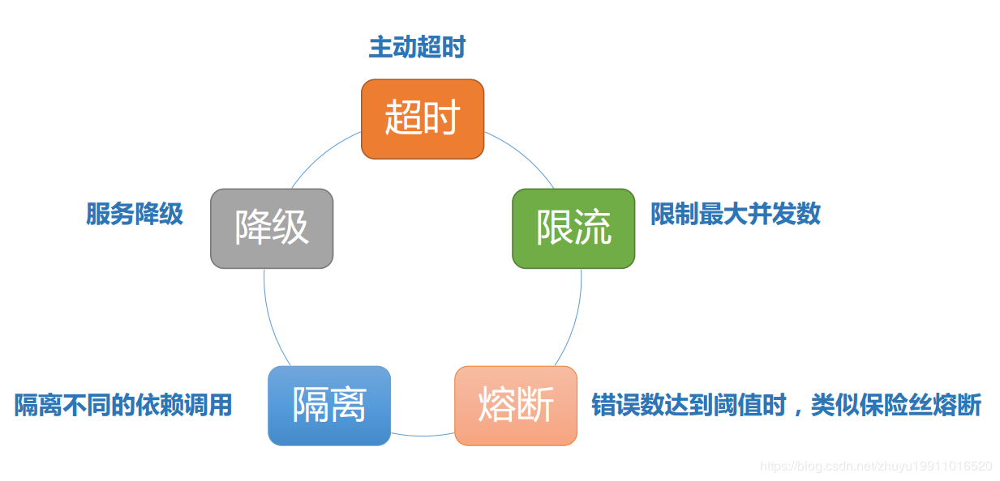

# 高并发：熔断与降级

## 1.为什么需要熔断与降级

在分布式微服务环境下，服务之间经常是存在相互依赖的关系的  

## 2 服务熔断

**降级一般而言指的是我们自身的系统出现了故障而降级。而熔断一般是指依赖的外部接口出现故障的情况断绝和外部接口的关系。**

例如你的A服务里面的一个功能依赖B服务，这时候B服务出问题了，返回的很慢。这种情况可能会因为这么一个功能而拖慢了A服务里面的所有功能，因此我们这时候就需要熔断！即当发现A要调用这B时就直接返回错误(或者返回其他默认值啊啥的)，就不去请求B了。我这还是举了两个服务的调用，有些那真的是一环扣一环，出问题不熔断，那真的是会雪崩。

## 3 服务降级

降级也就是服务降级，当我们的服务器压力剧增为了**保证核心功能的可用性** ，而**选择性的降低一些功能的可用性，或者直接关闭该功能**。这就是典型的**丢车保帅**了。 就比如贴吧类型的网站，当服务器吃不消的时候，可以选择把发帖功能关闭，注册功能关闭，改密码，改头像这些都关了，为了确保登录和浏览帖子这种核心的功能。

## 4 熔断方案

### 4.1 Hystrix 方案

### 4.2 Sentinel 方案

### 4.3 其他方案

---

【参考文档】

- https://github.com/Netflix/Hystrix/wiki/How-it-Works

- https://developer.aliyun.com/article/694256#slide-19
- https://sentinelguard.io/zh-cn/blog/sentinel-vs-hystrix.html
