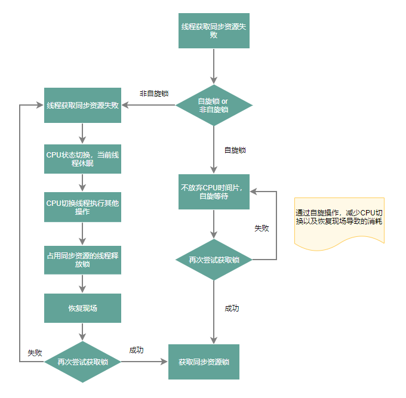

# 这一次彻底搞清楚Java中的锁


Java提供了种类丰富的锁，按照是否含有某一特性可以将锁进行分组归类。

- 悲观锁、乐观锁
- 阻塞、非阻塞（自旋锁、适应性自旋锁）
- 无锁、偏向锁、轻量级锁、重量级锁
- 公平锁、非公平锁
- 可重入锁、非可重入锁
- 共享锁、排他锁


(图片源自自https://tech.meituan.com/2018/11/15/java-lock.html)

## 1.悲观锁、乐观锁

### 基本概念与原理
对于同一个数据的并发操作
- **悲观锁**认为自己在使用数据的时候一定有别的线程来修改数据，因此在获取数据的时候会先加锁，确保数据不会被别的线程修改。
- **乐观锁**认为自己在使用数据时不会有别的线程修改数据，所以不会添加锁，只是在更新数据的时候去判断之前有没有别的线程更新了这个数据。
如果这个数据没有被更新，当前线程将自己修改的数据成功写入。如果数据已经被其他线程更新，则根据不同的实现方式执行不同的操作（例如报错或者自动重试）

乐观锁在Java中是通过使用无锁编程来实现，最常采用的是CAS算法。这里先简单介绍下CAS算法。

>**CAS**全称 Compare And Swap（比较与交换），是一种无锁算法。在不使用锁（没有线程被阻塞）的情况下实现多线程之间的变量同步。
java.util.concurrent包中的原子类就是通过CAS来实现了乐观锁。
>
>CAS算法涉及到三个操作数：
>
>- 需要读写的内存值 V。
>- 进行比较的值 A。
>- 要写入的新值 B。
>
>当且仅当 V 的值等于 A 时，CAS通过原子方式用新值B来更新V的值（“比较+更新”整体是一个原子操作），否则不会执行任何操作。一般情况下，“更新”是一个不断重试的操作。

**CAS虽然很高效，但是它也存在三大问题，这里也简单说一下：**

>1. **ABA问题**。CAS需要在操作值的时候检查内存值是否发生变化，没有发生变化才会更新内存值。但是如果内存值原来是A，后来变成了B，然后又变成了A，那么CAS进行检查时会发现值没有发生变化，但是实际上是有变化的。ABA问题的解决思路就是在变量前面添加版本号，每次变量更新的时候都把版本号加一，这样变化过程就从“A－B－A”变成了“1A－2B－3A”。
 JDK从1.5开始提供了AtomicStampedReference类来解决ABA问题，具体操作封装在compareAndSet()中。compareAndSet()首先检查当前引用和当前标志与预期引用和预期标志是否相等，如果都相等，则以原子方式将引用值和标志的值设置为给定的更新值。
> 2. **循环时间长开销大**。CAS操作如果长时间不成功，会导致其一直自旋，给CPU带来非常大的开销。
> 3. **只能保证一个共享变量的原子操作**。对一个共享变量执行操作时，CAS能够保证原子操作，但是对多个共享变量操作时，CAS是无法保证操作的原子性的。
 Java从1.5开始JDK提供了AtomicReference类来保证引用对象之间的原子性，可以把多个变量放在一个对象里来进行CAS操作。

借用下[美团技术团队博客](https://tech.meituan.com/2018/11/15/java-lock.html) 的图来展示下乐观锁和悲观锁的流程。


### 特点分析

根据从上面的概念描述我们可以发现：
- 悲观锁适合写操作多的场景，先加锁可以保证写操作时数据正确。
- 乐观锁适合读操作多的场景，不加锁的特点能够使其读操作的性能大幅提升。
- 缺点是在使用时需要注意CAS带来的三个问题的处理

### 应用示例
```java
// ------------------------- 悲观锁的调用方式 -------------------------
// synchronized
public synchronized void testMethod() {
	// 操作同步资源
}

// ReentrantLock
private ReentrantLock lock = new ReentrantLock(); // 需要保证多个线程使用的是同一个锁
public void modifyPublicResources() {
	lock.lock();
	// 操作同步资源
	lock.unlock();
}

// ------------------------- 乐观锁的调用方式 -------------------------
private AtomicInteger aint = new AtomicInteger(100);// 需要保证多个线程使用的是同一个AtomicInteger
boolean b = aint.compareAndSet(100,200); // 修改expect与当前值不同测试
if (b) {
	// 成功获取锁，操作同步资源
}
```
## 2.自旋锁、适应性自旋锁

### 自旋实现原理

- 概念

自旋锁流程图



### 特点分析

### 自旋锁应用示例

### TicketLock，MCSLock，CLHLock


## 3.锁状态（无锁、偏向锁、轻量级锁、重量级锁） 

这四种锁是指锁的状态，专门针对synchronized的

### 概念及原理

- 原理分析

- 锁升级过程


## 4.公平锁、非公平锁

### 基本概念与原理
- 基本表述
- 流程图

### 特点分析

### 应用示例

## 5.可重入锁、非可重入锁

### 基本概念与原理
- 基本表述
- 流程图

### 特点分析

### 应用示例


## 6.共享锁、排他锁

### 基本概念与原理
- 基本表述
- 流程图

### 特点分析

### 应用示例

--- 

参考资料：

- [不可不说的Java“锁”事](https://tech.meituan.com/2018/11/15/java-lock.html)
- [看完你就明白的锁系列之自旋锁](https://juejin.im/post/6844903967185436679)
- [Java并发——Synchronized关键字和锁升级，详细分析偏向锁和轻量级锁的升级](https://blog.csdn.net/tongdanping/article/details/79647337)
- [Synchronized锁升级过程详解](https://qtalex.com/synchronizedsuo-sheng-ji-guo-cheng-xiang-jie/)
- [图文深入解析 JAVA 读写锁，为什么读锁套写锁会死锁，反过来却不会？](https://my.oschina.net/anur/blog/3061764)

